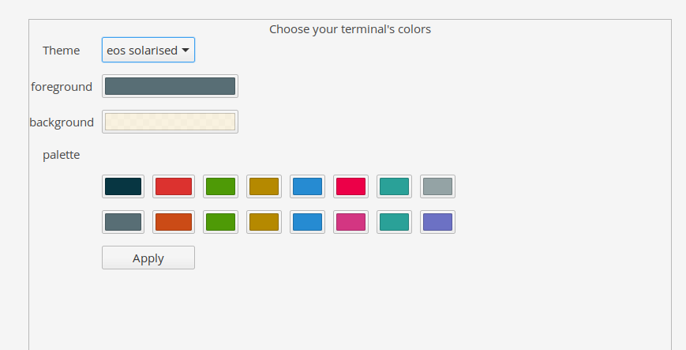

# Terminal colors

 

<h1>Description:</h1>
A Plug for Switchboard in elementary that helps you to 
change your colors in elementary's terminal :  

<h1>Build and install (developper)</h1>

Download the last release (zip) et extract files 

<h2>Dependencies:</h2>
These dependencies are needed for building :  
<pre>sudo apt-get install gcc valac gtk+-3.0 switchboard-2.0 meson </pre/>

<h2>Build with meson:</h2>

Open a Terminal in the extracted folder, build your application with meson and install it with ninja: 

<pre>meson build --prefix=/usr
cd build
ninja
sudo ninja install
</pre>

Restart switchboard to find your widget. 

<h2>Uninstall (need the extracted files)</h2>
In the previous folder ( /build) run the command : 
<code>sudo ninja uninstall</code>

